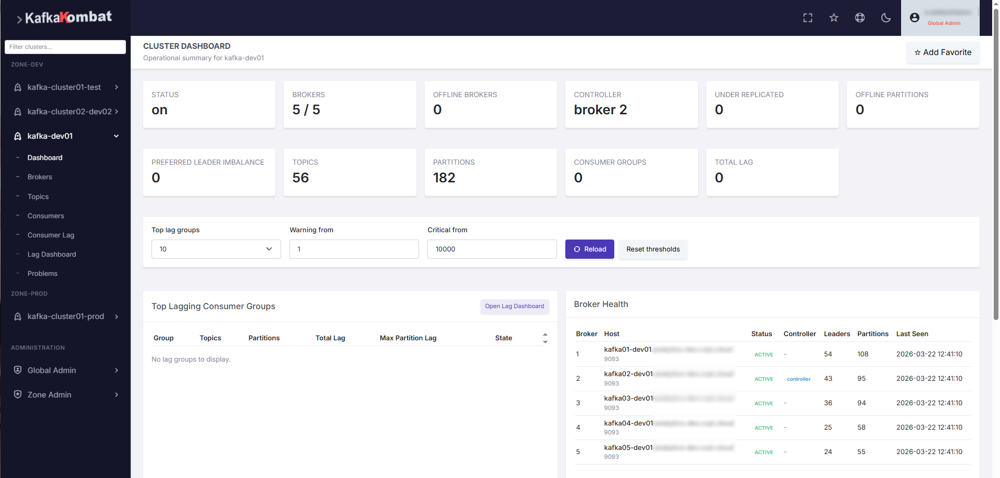
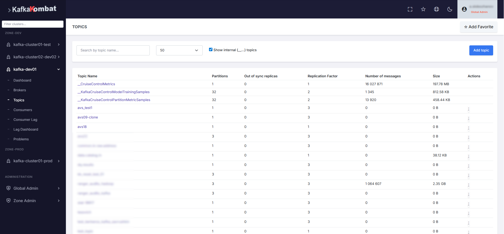
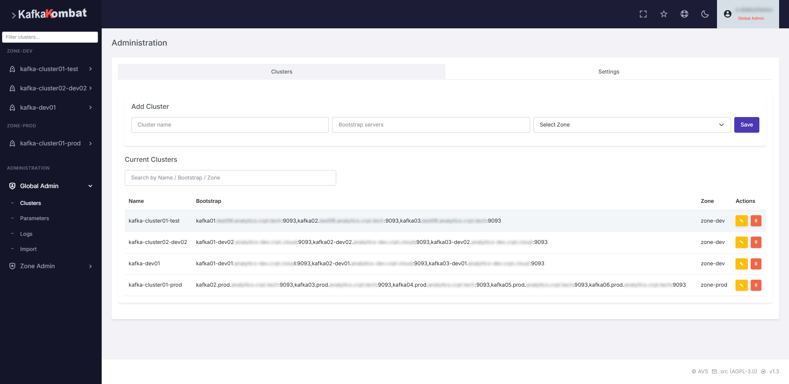
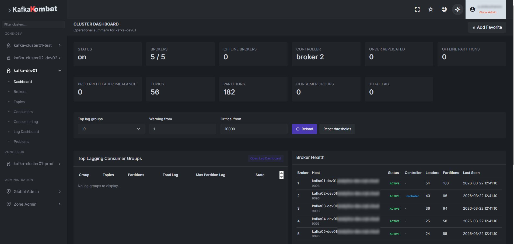
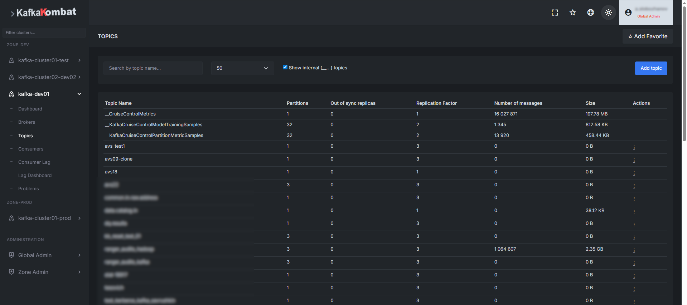
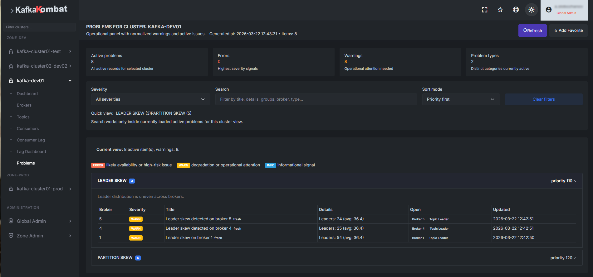

# KafkaKombat

KafkaKombat is a Kerberos-first web UI for Apache Kafka.

This repository currently publishes project information, licensing files, installation guidance, and release references. Source code is **not published in this repository at this time**. Source code publication and the move to Open Source are planned starting with version 2.2

GitHub repo is a public project entry point and the website is the primary public release channel

## Project status

Current public release line: **v1.3**

KafkaKombat is intended for environments where Kerberos is a mandatory part of the Kafka access model. It is not presented as a generic Kafka UI for simplified standalone deployments without Kerberos.

Production status:
- used in development and production environments
- used by multiple internal teams
- intended for multi-cluster Kafka environments with corporate security requirements

Kerberos and Kafka client model:
- Kerberos authentication is used through SASL/GSSAPI
- user-driven Kafka operations from the UI are executed in the Kerberos context of the user
- the product is designed around the user's own Kerberos ticket rather than a shared service identity for normal UI operations
- service principal and keytab are reserved for background and backend tasks

Supported Apache Kafka versions:
- tested with Apache Kafka 3.0.0 through 4.2.0
- if support for other Kafka versions is required, please open an issue at https://github.com/kafkakombat/kafkakombat/issues or use the contact form on the project website

## What is published here

- project overview
- installation guidance
- security contact information
- license and notice files
- release references

## Releases

Public release artifacts are published through the project website and can also be mirrored through GitHub Releases.

Primary release page:
- https://kafkakombat.com/releases

Current stable server distribution:
- `kafkakombat-1.3.tar.gz`

## Documentation

- [Installation Guide](docs/INSTALL.md)
- [Release Notes and Publishing Model](docs/RELEASES.md)
- [Security Policy](SECURITY.md)

## Screenshots

### Light theme

### Dark theme

## Scope of this repository

This repository is intended to provide a clean public project entry point until the source publication stage.

At this stage, it is suitable for:
- public project presentation
- release discovery
- installation orientation
- security reporting guidance

It is not yet intended to be the full development repository.

## Security model summary

KafkaKombat follows a Kerberos-first model:
- Kerberos is the authentication base
- Kerberos Kafka access is based on SASL/GSSAPI
- LDAP/directory lookup is used for user lookup and group resolution
- application access is additionally restricted by RBAC
- user Kafka operations from the UI are executed in the Kerberos context of the user
- the central operational model is user-ticket execution for UI-driven Kafka requests

## License

KafkaKombat is distributed under the GNU Affero General Public License v3.0 (AGPL-3.0).

See [LICENSE](LICENSE) and [NOTICE](NOTICE) for details.
